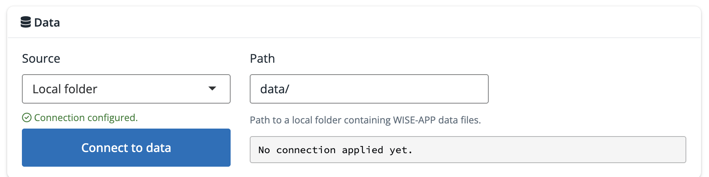

## Overview

WISE-APP connects to a data directory with three sub-folders containing: **metadata**, **microdata**, and **hazard** datasets. 

- **Metadata** files are small CSV files that catalog survey rounds, variables, and monetary conversions. They are loaded when WISE-APP starts and drive the user interface.
- **Microdata** files contain individual, household, or firm-level survey data.
- **Hazard** files contain historical weather and future climate projections data.



All datasets follow the [WISE-APP data schema](#wise-app-data-schema) described below. 

## Connecting WISE-APP to Data

When accessing WISE-APP via the [internal World Bank web app](https://datanalytics-int.worldbank.org/wise-app){target="_blank"}, the data connection is **automatically configured**. The app connects directly to a curated Databricks volume hosting harmonized GMD surveys, ERA5-Land reanalysis, and CMIP6 climate scenarios.

::: {.callout-note appearance="simple"}
### Data Preparation Repository
The pipelines used to prepare datasets for WISE-APP are maintained in the [wise-app-data](https://github.com/worldbank/wise-app-data){target="_blank"} repository.
:::

### Local R Package

When running the app locally in R, the **Overview** landing page provides an interactive **Data** panel to connect to data in a local folder or remote file system. Supported remote storage includes Databricks, AWS S3, Google Cloud Storage, Hugging Face, and Azure. 



::: {.callout-tip appearance="simple"}
### Environment Credentials
Credential fields in the UI to connect to remote storage are optional if credentials are pre-configured in your local `.Renviron` file (e.g., `AWS_ACCESS_KEY_ID`, `AZURE_STORAGE_KEY`, `DATABRICKS_HOST`, etc.).
:::

## Spatial Integration: H3
WISE-APP links microdata and hazard layers across space using the [H3 spatial indexing system](https://h3geo.org) [@uber2018], which partitions the globe into hexagonal cells.

Observations in microdata are mapped to H3 hexagons using interview location information collected in surveys. Gridded hazard datasets are resampled onto the same H3 grid. This enables flexible spatial joins across scales using H3 hierarchical relationships.


## Data Sources 

This section describes the data sources used for the [internal World Bank web app](https://datanalytics-int.worldbank.org/wise-app){target="_blank"}. 

::: {.callout-tip appearance="simple"}
### Custom data
When running WISE-APP locally, users can bring their own microdata (individual, household or firm level) and hazard data if it follows the standardized [WISE-APP data schema](#wise-app-data-schema) and directory structure. See the [data prep repository](https://github.com/worldbank/wise-app-data){target="_blank"} for examples.
:::

### Household Survey Microdata (GMD)

Household survey microdata are from the World Bank’s **Global Monitoring Database (GMD)** [@worldbank2026], a harmonized collection of nationally representative multi-topic household surveys covering over 150 low- and middle-income countries across more than 2,000 survey waves from 1989 to the present. GMD provides standardized welfare aggregates, poverty measures, and demographic indicators. 

::: {.callout-warning appearance="simple"}
### GMD variable coverage and comparability
Note that some GMD variables are only available in a subset of surveys. In addition, despite harmonization efforts, variables may not be strictly comparable across surveys due to differences in survey design, question wording, and sampling frames.
:::

WISE-APP uses a curated subset of GMD surveys that have been enhanced with standardized geocodes, interview timestamps, and spatial variables. This provides the consistent spatial-temporal key needed to merge survey records with gridded climate data. Additional GMD survey rounds are processed and added to the repository over time.

::: {.callout-note appearance="simple"}
### Geocoding GMD Surveys
[Geocoding GMD](https://datanalytics-int.worldbank.org/geocoding-gmd/){target="_blank"}(internal) explains how GMD surveys are geocoded to H3 hexagons using available location information (GPS coordinates or small mappable regions).
:::

The GMD microdata is prepared at both individual and household level for WISE-APP. This enables analysis of individual-level outcomes such as employment variables, as well as outcomes measured at the household level, such as consumption per capita. The level of analysis is the first filter applied in the WISE-APP interface, and determines which microdata is loaded by the app.

GMD surveys exhibit substantial variability in temporal and geographic precision. Some surveys conduct interviews rolling across all 12 calendar months with granular GPS coordinates representing thousands of distinct clusters. Others are conducted over only a few months or are spatially anonymized to coarse administrative units (e.g., province or region). This is important for interpreting the results of the weather-welfare model and subsequent climate simulations, as discussed in [Step 1](step1.qmd).

::: {.callout-note appearance="simple"}
### Access to GMD Microdata
GMD microdata files are not available to the public due to licensing restrictions. They are available to World Bank staff from `datalibweb` or pre-processed for the internal web app using scripts available in the [wise-app-data repository](https://github.com/worldbank/wise-app-data){target="_blank"}.
:::

### WISE-APP Survey Coverage

The map below shows the countries with geocoded GMD survey rounds currently available in WISE-APP. 



### Historical Weather Reanalysis (ERA5-Land)

Historical weather data are derived from **ERA5-Land** [@munozsabater2021], a global climate reanalysis produced by the European Centre for Medium-Range Weather Forecasts (ECMWF). ERA5-Land combines physical modeling with global in-situ and satellite observations to provide consistent, hourly estimates of meteorological variables at a ~9 km spatial resolution from 1950 to the present.

WISE-APP uses monthly aggregates of selected ERA5-Land variables (e.g., mean maximum daily temperature, number of very hot days, precipitation sums) sourced from the dataset underpinning the Copernicus Interactive Climate Atlas [@c3satlas2024], spatially mapped onto H3 hexagonal cells for linking to microdata. 

The full list of weather variables available is provided in the [variable list](#variable-list) below (filter to `hazard`).

### Climate Change Scenarios (CMIP6 SSPs)

For climate projections, WISE-APP uses data derived from the **Coupled Model Intercomparison Project Phase 6 (CMIP6)** [@eyring2016] representing three Shared Socioeconomic Pathways (SSPs):

- **SSP 2-4.5:** Intermediate greenhouse gas emissions trajectory.
- **SSP 3-7.0:** Medium-to-high emissions baseline trajectory.
- **SSP 5-8.5:** High-end emissions fossil-fueled development trajectory.

WISE-APP uses CMIP6 data for the same weather variables derived from ERA5-Land for up to 30 ensemble members at native grid resolutions (typically 100–250 km), across both baseline (1950–2014) and projection periods (2015–2100). These are sourced from the same Copernicus Interactive Climate Atlas dataset [@c3satlas2024]. WISE-APP uses the full ensemble rather than a single or median GCM to capture uncertainty in climate projections [@burkedykema2015]. This approach recognizes that adaptation and resilience policies should be informed by the full range of possible climate outcomes as relying only on central estimates can be misleading.

::: {.callout-note appearance="simple"}
### Climate perturbation method
WISE-APP employs a **delta method** to perturb historical ERA5-Land baseline observations using the projected monthly change fields from each CMIP6 model (see [Step 2](step2.qmd) for more detail). This approach preserves the historical variability captured by ERA5-Land and corrects for model biases, isolating the climate signal from systematic model errors.
:::

## Variable list {#variable-list}

The table below lists variables in GMD microdata and ERA5-Land / CMIP6 hazard data prepared for the [internal World Bank web app](https://datanalytics-int.worldbank.org/wise-app){target="_blank"}. The role of each variable is defined by the `variable_list.csv` metadata file, which is loaded when WISE-APP starts. 

::: {.callout-warning appearance="simple"}
### Variable Coverage & Missing Data
Not all variables are available in every survey round and some are only available for specific levels of analysis. Check the **Survey stats** tab to review variable availability for the selected sample when using the app.
:::



## WISE-APP Data Schema

This section describes the WISE-APP data schema for metadata, microdata, and hazard datasets used by the app. The schema is designed to support flexible spatial-temporal joins between survey microdata and gridded climate data and allow for future expansion to additional data sources. The schema is implemented in the [wise-app-data](https://github.com/worldbank/wise-app-data){target="_blank"} repository.

### Metadata

Three CSV files are loaded when WISE-APP initializes. They drive UI filtering, variable labeling, and monetary conversions.

#### `survey_list.csv`

Catalogs every survey round and observation level available in the microdata repository:

| Column | Type | Description |
|---|---|---|
| `economy` | string | Economy / country name |
| `code` | string | ISO 3166-1 alpha-3 country code |
| `year` | integer | Starting year of survey |
| `survname` | string | Survey acronym (e.g., `EHCVM`, `LSMS`, `HIES`) |
| `level` | string | Unit of observation: `hh` (household), `ind` (individual), or `firm` |
| `obs` | integer | Total number of observations |
| `source` | string | Harmonization source (e.g., `GMD`) |

#### `variable_list.csv`

Catalogs all microdata + hazard data variables and specifies their role and treatment in the modeling interface:

| Column | Type | Description |
|---|---|---|
| `name` | string | Variable name in microdata files |
| `label` | string | Human-readable label displayed in the UI |
| `type` | string | Data type: `numeric`, `integer`, `logical`, `factor`, `character`, `Date` |
| `units` | string | Unit of measurement (e.g., `LCU/day`, `years`, `mm`) |
| `id` | binary | 1 if identifier, date, or administrative variable |
| `outcome` | binary | 1 if variable can serve as a dependent welfare outcome |
| `hazard` | binary | 1 if weather or climate hazard metric |
| `ind` | binary | 1 if available in individual-level data |
| `hh` | binary | 1 if available in household-level data |
| `firm` | binary | 1 if available in firm-level data |
| `area` | binary | 1 if measured at the geographic/community level |
| `interact` | binary | 1 if available as a policy/resilience interaction term |
| `fe` | binary | 1 if available as a fixed effect in regression models |

#### `cpi_ppp.csv`

Provides deflators and purchasing power parity (PPP) conversion factors to convert monetary aggregates from nominal local currency units (LCU) to constant 2021 PPP:

| Column | Type | Description |
|---|---|---|
| `code` | string | ISO 3166-1 alpha-3 country code |
| `year` | integer | Survey year |
| `data_level` | string | Geographic level of price index (e.g., `national`, `urban`, `rural`) |
| `cpi` | numeric | Consumer Price Index deflator |
| `ppp2021` | numeric | 2021 PPP conversion factor |

### Microdata

Microdata files are stored in Apache Parquet format under `microdata/{level}/{code}/` following the naming convention `{code}_{year}_{survname}_{source}_{level}.parquet`:

```
microdata/hh/GNB/GNB_2018_EHCVM_GMD_hh.parquet
microdata/ind/GNB/GNB_2018_EHCVM_GMD_ind.parquet
microdata/firm/GNB/GNB_2018_EHCVM_GMD_firm.parquet
microdata/h3/GNB/GNB_2018_EHCVM_GMD_h3.parquet
```

All microdata files share standard identifiers: `code`, `economy`, `year`, `survname`, `int_year`, `int_month`, `loc_id`, plus relevant thematic attributes.

#### Household file (`_hh.parquet`)

One row per surveyed household. Key columns include:

- `hhid`: Unique household identifier within the survey.
- `welfare`: Household welfare measure (consumption or income in LCU/day, converted to 2021 PPP within the app).
- `hhsize`: Number of household members.
- `loc_id`: Unique location code linking to the spatial H3 lookup.
- Resilience and asset indicators: electricity access, water source, dwelling characteristics, education of household head, etc.

#### Individual file (`_ind.parquet`)

One row per individual. Key columns include `hhid`, `pid` (person identifier), `wage` (earnings in LCU/day), `age`, `male`, `educy` (years of education), `empstat` (employment status), and `loc_id`.

#### Firm file (`_firm.parquet`)

One row per enterprise. Key columns include `fid` (firm identifier), `revenue` (daily revenue in LCU/day), `employees`, and `loc_id`.

::: {.callout-note appearance="simple"}
### Firm Microdata
Firm microdata, from sources such as World Bank Enterprise Surveys, is flagged for future release. It is not currently available in the internal web app.
:::

#### H3 Spatial Lookup file (`_h3.parquet`)

Maps survey clusters (`loc_id`) to H3 hexagonal cells. A single lookup file covers all microdata levels from the same survey:

- Required columns: `code`, `year`, `survname`, `loc_id`, and `h3` (hexadecimal H3 index string).
- Optional column: `pop_2020` (GHS-POP 2020 population count; @schiavina2022), used to weight weather aggregations when a survey cluster spans multiple H3 cells.

### Hazard Data

Hazard datasets are stored in Parquet format, spatially indexed by H3 hexagon cells (`h3`, the join key to the `_h3.parquet` lookup) and temporally indexed at monthly resolution (`timestamp`, formatted as the first day of the month) to align with microdata interview dates.

#### Historical Weather

Stored under `hazard/weather/historical/{code}/{code}_{source}.parquet` (e.g., `GNB_era5land.parquet`).

Key variables include:

- `t`, `tn`, `tx`: Monthly mean, daily minimum, and daily maximum temperature (°C).
- `tx35`, `tr`: Monthly extreme hot days and tropical nights (days).
- `r`: Total monthly precipitation (mm).
- `rx5day`: Monthly maximum 5-day precipitation (mm).
- `r20`: Monthly very heavy precipitation days (days).
- `mrsos`: Monthly soil moisture in the upper soil portion (kg m⁻²).
- `spei6`: Standardized Precipitation-Evapotranspiration Index at a 6-month horizon.

#### Climate Projections

Stored under `hazard/weather/projections/{code}/{code}_{source}_{scenario}.parquet`:

```
GNB_cmip6_historical.parquet   # CMIP6 historical baseline (1950–2014)
GNB_cmip6_ssp245.parquet       # CMIP6 SSP 2-4.5 (2015–2100)
GNB_cmip6_ssp370.parquet       # CMIP6 SSP 3-7.0 (2015–2100)
GNB_cmip6_ssp585.parquet       # CMIP6 SSP 5-8.5 (2015–2100)
```

In projection files, an additional `model` column identifies each climate model within the CMIP6 ensemble.

::: {.callout-note appearance="simple"}
#### Extreme Events (Future Release)
Modules for discrete historical and probabilistic extreme events (e.g., riverine floods, tropical cyclone return periods) are planned for future releases of WISE-APP. See [wise-app-data](https://github.com/worldbank/wise-app-data){target="_blank"} for proposed schema and data structure.
:::

## References {.unnumbered}


