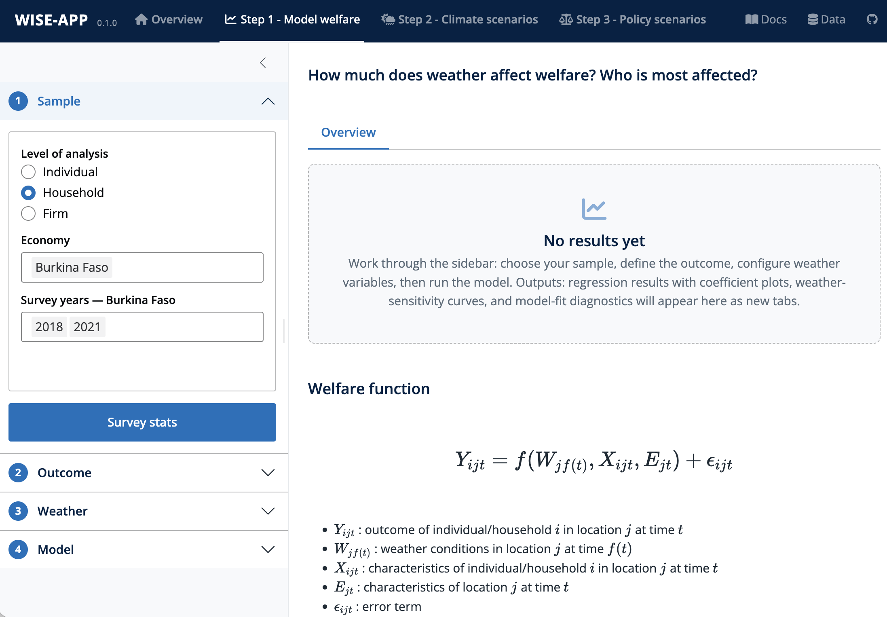

## Overview

Step 1 estimates the empirical relationship between local weather anomalies and socioeconomic outcomes, such as household consumption, income, and poverty status. 

It answers the question: **How does weather variability affect welfare, and who is most affected?**

A model is fitted to historical data to quantify how weather shocks affect welfare on average and across population sub-groups, forming the statistical foundation for the simulations in [Step 2 (Climate Scenarios)](step2.qmd) and [Step 3 (Policy Scenarios)](step3.qmd).

This step has four stages corresponding to the interactive panels in the sidebar:

1. **Sample:** Select analysis level, economies, and survey rounds; inspect sample statistics and spatial coverage.
2. **Outcome:** Choose and configure dependent welfare outcomes (consumption, poverty status).
3. **Weather:** Select weather variables and configure reference periods, temporal aggregations, and non-linear transformations.
4. **Model:** Specify model types, policy interactions, fixed effects, and covariates, then fit the model.

## Step-by-Step Instructions

### 1. Sample Selection

Configure the survey sample used for econometric modeling:

- **Level of Analysis:** Choose between `Household` (default), `Individual`, or `Firm`. This determines which microdata files and variables are loaded.
- **Economy:** Select up to two economies with surveys.
- **Survey Year:** Select available survey rounds for the chosen economies.

By default, all available survey waves are selected to maximize sample size and climate variation.

Click **Survey stats** to load the data and open a diagnostic tab containing:

- **Timing of interviews:** a monthly bar chart of interview dates for each survey wave.
- **Location of interviews:** an interactive H3 map with a **Locations / Sample density** toggle. *Locations* outlines each survey location; *Sample density* shades H3 cells by the number of sampled units they contain. A wave picker filters both views when several rounds are loaded.
- **Outcome stats:** candidate outcome variables available for welfare analysis, with missingness rates.
- **Policy variables:** the variables that can be adjusted in Step 3 policy scenarios.
- **Summary statistics tables:** summary statistics for individual-, household-, firm-, and area-level variables (filtered to the selected level of analysis).

::: {.callout-tip appearance="simple"}
### Start with Survey Stats
Before modeling, review the **Survey stats** tab to verify sample sizes, check for systematic geographic gaps, and understand missing data rates across candidate variables.
:::

#### Interpreting the Survey stats

The interview-timing chart and the location map together determine how much exploitable weather variation the sample contains: the map shows *where* interviews are spread, the timing chart shows *when*. 

- Use the **interview-timing** chart to check whether waves are fielded in different seasons. Waves fielded in the same months across years provide little seasonal variation for identification.
- Use the **location map** to check whether waves are fielded in the same locations. Waves fielded in different locations provide little within-location variation for identification.
- Compare the **Locations** and **Sample density** map views: outlined locations show the spatial footprint, while the density shading reveals whether sampled units cluster in a few cells.
- Use the **outcome stats** table to check missingness in candidate outcomes before selecting one — high missingness limits the effective sample once covariates are introduced in the **Model** stage.
- The **policy variables** table previews which Step 3 policy scenarios will be available with the current data.

::: {.callout-warning appearance="simple"}
### Spatial & Temporal Resolution
The precision of econometric estimates depends directly on the spatial and temporal granularity of the underlying survey:

- **Spatial precision:** Surveys with cluster-level GPS coordinates capture localized weather extremes accurately. When surveys are anonymized to coarse administrative units (e.g., province or region), households are assigned spatially averaged weather metrics. This smooths out local shock variation and introduces classical measurement error that attenuates estimated coefficients toward zero.
- **Temporal precision:** Rolling surveys conducted across all 12 calendar months provide rich seasonal weather variation. Surveys fielded in short windows (e.g., 1–2 months) or lacking interview month timestamps offer limited within-location weather variation, reducing statistical power and complicating identification under spatial and temporal fixed effects.

:::

### 2. Welfare Outcome

Define the dependent variable ($y_{ijt}$) for the regression:

- **Continuous Outcomes:** Household consumption (`welfare`) or other continuous welfare metrics per capita per day, as flagged in the [variable list](data.qmd#variable-list) metadata.
- **Binary Outcomes:** Poverty status indicator (`poor`) — constructed automatically as welfare below the poverty line — or other binary welfare metrics.
- **Currency:** For monetary aggregates, choose between:
  - **PPP (2021)** (default) — constant 2021 international dollars, enabling cross-country comparability.
  - **LCU (2021)** — local currency units at 2021 prices. The PPP–LCU factor is constant within an economy and absorbed by the fixed effects, so coefficient estimates are unchanged — the choice sets the units of the poverty line and of predicted and simulated welfare levels. Welfare is additionally bottom-coded at \$0.28/day (2021 PPP) at load, following the World Bank Poverty and Inequality Platform (PIP) [Methodology](https://datanalytics.worldbank.org/PIP-Methodology/welfareaggregate.html#bottom){target="_blank"}.
- **Poverty Line:** When modeling poverty status, specify the poverty threshold (default: $3.00/day in 2021 PPP USD, or the weighted 20th percentile of the sample distribution in LCU).

Click **Outcome stats** to open a diagnostic tab with:

- **Summary statistics:** observations, coverage rate, and distribution quantiles (continuous outcomes) or event counts and shares (binary outcomes).
- **Outcome distribution:** a ridge plot of the outcome by survey wave, with poverty lines overlaid when the outcome is `welfare`.
- **Spatial coverage:** an H3 map shaded by the share of sampled units with a non-missing outcome at each location, filterable by wave.

#### Interpreting the Outcome stats

- In the distribution plot, check how the waves overlap: waves sitting at persistently different levels may reflect genuine welfare differences, survey-design differences, or different fielding seasons. Anchor expectations against the poverty lines before interpreting simulated shifts in Step 2.
- The coverage map identifies where outcome data is missing. Coverage gaps translate directly into sample loss once covariates with missing values are added in the **Model** stage.
- For poverty outcomes, confirm the poverty line produces a plausible headcount: with the default $3.00/day line, a sample with a near-zero or near-100% poverty rate leaves little distributional variation for the model to explain.

::: {.callout-tip appearance="simple"}
### Check the Welfare Distribution
WISE-APP applies a logarithmic transformation to all continuous (numeric) outcomes during estimation, so coefficients are interpreted on the log scale. Raw consumption values must be strictly positive and not pre-log-transformed in the source data.
:::

::: {.callout-tip appearance="simple"}
### Continuous Welfare vs. Binary Poverty
For poverty impacts, modeling continuous welfare is often more informative than modeling the `poor` indicator directly: Step 2 evaluates simulated welfare *distributions* against the poverty line, so the binary route discards within-group distributional information that the simulations rely on. The binary outcome remains useful for headcount-focused questions, and RIF quantile regressions offer a third view by estimating effects across the welfare distribution.
:::

### 3. Weather Variables & Transformations

Select up to two weather variables from the ERA5-Land reanalysis catalogue (e.g., Mean Temperature `t`, Precipitation `r`, Drought Index `spei6`).

::: {.callout-tip appearance="simple"}
### Combining Two Weather Variables
When selecting two variables, prefer distinct hazards (e.g., temperature with precipitation, or rainfall totals with a drought index) over near-duplicate aggregations of the same variable: highly correlated regressors inflate standard errors and can flip coefficient signs across specifications. Reference periods can be set independently per variable, so align each window with the mechanism it is meant to capture — growing-season months for crop-sensitive outcomes, for example.
:::

Click **Configure** beside each selected variable to open the configuration flyout:

- **Reference Period Range:** A slider selecting the window of months before the interview date to measure (0 to 12 months, default: `1 to 1`). This allows capturing specific windows or seasonal shocks.

::: {.callout-note appearance="simple"}
### Agricultural growing-season reference period (Future Release)
Planned future releases will include crop-specific growing seasons to better facilitate agricultural impact analysis. Users can then select a crop and the app will automatically set the reference period to the relevant months for that crop in the given location.
:::

- **Temporal Aggregation:** Summary function across the reference period. `Mean`, `Median`, `Min`, and `Max` are always available; `Sum` is additionally offered for precipitation-type variables (units `mm` or `days`) and is the default there. `Mean` is the default for all other variables.
- **Transformation:** (default: `None` for dimensional variables)
  - *None:* Raw aggregated value in physical units (°C, mm).
  - *Deviation from mean:* Subtracts the location's long-run monthly average over the 1991–2020 climate normal, measuring anomalous weather conditions relative to the local baseline.
  - *Standardized anomaly:* Deviation divided by the historical monthly standard deviation, yielding dimensionless, unit-free standardized shocks comparable across regions. Dimensionless indices (e.g., `spei6`) accept only this option and use it by default.
- **Variable Treatment:**
  - *Binned* (default): Converts the weather variable into categorical bins using a **Number of bins** slider (2–10, default 5). Binned specifications do not impose parametric functional forms and capture non-linear effects. Duplicate bins are dropped, which can reduce the bin count below the requested number. Bin breaks are derived from the distribution of the configured weather value across the **survey sample**, not from the historical climate. Binning methods:
    - `Equal frequency` (sample quantiles, default)
    - `Equal width`
    - `K-means` clustering
    - `Custom` comma-separated break points; the outermost bins are open-ended so out-of-range values still map to the extreme bins. 
  - *Continuous:* Enters the numeric variable directly, with optional `Quadratic` ($X^2$) or `Cubic` ($X^3$) polynomial expansion terms.
- **Historical Comparison Settings:** Year range (default: 1991–2020) controlling how many years of historical weather are loaded for the Weather stats displays below — each wave's distribution is drawn against climate over the same locations and calendar months within this window. The deviation/anomaly transformations always use the fixed 1991–2020 climate normal regardless of this setting.

Click **Weather stats** to merge the constructed weather regressors with the survey observations and open a diagnostic tab with:

- **Distribution of weather:** each wave's distribution with that wave's own climate history (over the configured year range) drawn alongside it, for sampled locations.
- **Weather by location:** maps of the sample locations shaded by the regressor value, with cross-sectional and within-location views (*Difference from own historical mean*, *Percentile in own history*).
- **Outcome vs weather:** binned scatter plots of the outcome against each weather variable, useful for spotting non-linear relationships before modeling.
- **Weather summary stats:** weighted summary statistics for each weather variable, aggregated per country-year.

::: {.callout-tip appearance="simple"}
### Choosing Weather Transformations
Binned or anomaly transformations are recommended for cross-country and multi-region comparisons. When using continuous polynomial expansions, inspect diagnostic plots to ensure extreme observations at the tails are not driving artifactual curvature.
:::

::: {.callout-warning appearance="simple"}
### Extrapolation Under Climate Change
Step 1 coefficients are estimated on historical weather support, but projected climates shift weather distributions beyond it. With binned specifications, out-of-range values are assigned to the open-ended extreme bins — implicitly assuming the response stays at the top-bin effect. With continuous polynomials, predictions outside the estimation range can behave erratically (especially with cubic terms). Prefer anomaly transformations with bins for strongly warming scenarios, and use the diagnostics in Step 2, which overlay the scenario weather distribution against the estimation sample, to check how much of the simulated distribution lies outside the estimated support.
:::

#### Interpreting the Weather stats

- **Check the sample against its own history.** In the distribution panels, a wave's curve sitting in the far tail of its own historical distribution signals an unusual season, while heavy overlap indicates typical conditions. The comparison is within-location by construction: each wave is compared with climate over the same places and calendar months, not against other waves.
- **Read the within-location map views before modeling.** *Difference from own historical mean* shows the signed anomaly (blue below normal, red above), and *Percentile in own history* rescales it to 0–100 (50 = a typical year). Locations showing near-constant percentiles across waves offer little within-location variation for identification — the *Spatial & Temporal Resolution* caveat in the [Sample stage](step1.qmd#interpreting-the-survey-stats) also applies here.
- **Use the binscatter to preview functional form.** A monotone outcome-weather relationship supports a continuous specification; a flat-then-steep or U-shaped pattern argues for bins or polynomials. This is a descriptive check — it conditions on nothing — so treat it as a complement to, not a substitute for, the fixed-effects results.
- **Scan the summary stats for data-quality red flags:** many missing location-months, or summary statistics that differ sharply across survey rounds, indicate weather-merge gaps that will propagate into the regressions.

### 4. Model Specification & Estimation

Configure the regression specification and variable controls:

#### Model Type

The available model types depend on the outcome selected in the **Outcome** stage:

- **Linear Regression:** Fits an ordinary least squares model with high-dimensional fixed effects (`fixest::feols`). Estimates the average marginal effect of weather shocks on welfare. Available for both continuous and binary outcomes.
- **Logistic Regression:** Fits a generalized linear model with fixed effects (`fixest::feglm`) for binary outcomes. Coefficients represent log-odds ratios. Offered when a binary outcome is selected. Note that regions or waves containing no poor households contribute no within-group variation and can destabilize estimation (separation) — check the raw model summary in the Model fit tab if coefficients look implausibly large.
- **Unconditional Quantile Regression (RIF):** Fits unconditional quantile regressions via Recentered Influence Functions, estimating how weather impacts specific quantiles ($\tau = 0.1, 0.2, \dots, 0.9$) across the welfare distribution. Offered when a continuous outcome is selected.

::: {.callout-note appearance="simple"}
### Non-Parametric Engines (Random Forest, XGBoost)
Random forest and XGBoost engines are implemented in the estimation backend but are not yet exposed in the interface. The model types above are fully operational, including RIF.
:::

#### Policy Scenarios & Interaction Terms

In the sidebar, you can select one pre-defined **Policy Scenario** from the catalogue — *Energy / Electricity access*, *Improved water access*, *Sanitation access*, *Health access*, *Internet access*, *Mobile phone access*, *Piped water access* (and *on premises*), *Improved water and sanitation access*, and *Educational attainment* (primary, secondary, post-secondary). Only scenarios whose variables exist in the loaded data are offered. Selecting a policy automatically locks the corresponding survey variable as an interaction term ($\text{Haz}_{kt} \times \text{Policy}$) in the regression model; the locked variable cannot be removed from the interaction selector.

Alternatively, you can manually select an interaction moderator (default: `urban`), testing whether weather sensitivity differs between rural and urban households or across population sub-groups. Moderators are restricted to categorical (non-numeric) variables.

::: {.callout-warning appearance="simple"}
### Interaction Coefficients Are Not Policy Effects
The interaction coefficient $\gamma$ captures differential weather sensitivity between households with and without access as observed in the survey. Step 3 simulates policies by assigning non-access households the access group's sensitivity — an assumption that the sensitivity gap is caused by the access variable itself rather than by unobserved characteristics correlated with it (see the identification caveat in [Methodology below](#methodology-detail)). Treat simulated policy impacts as scenario arithmetic, not causal treatment effects.
:::

#### Model Settings

Click **Model settings** to configure advanced regression options:

- **Fixed Effects:** Select categorical variables to absorb (defaults to survey wave `year` and level 1 administrative region `gaul1_code`). Fixed effects remove unobserved spatial and temporal heterogeneity via within-group demeaning.
- **Covariate Selection:**
  - **User-Defined:** Manually select control variables organized by level (Individual, Household, Firm, Area). Variables selected as outcomes, weather terms, interactions, or fixed effects are automatically excluded from the candidate lists.
  - **LASSO:** This option performs data driven covariate selection using the Least Absolute Shrinkage and Selection Operator (LASSO) algorithm. It is recommended for high-dimensional datasets with many candidate covariates, or when the user is unsure which covariates to include. LASSO shrinks coefficients toward zero and sets some to exactly zero, effectively selecting a subset of predictors. The selected variables are then included in the final regression model. 
    - **Implementation:** Each selection pass fits a LASSO via `glmnet` with 10-fold cross-validation and retains the variables chosen by the `lambda.1se` rule (an advanced panel exposes the elastic-net mixing parameter, fold count, standardization, and lambda rule). The pass is repeated 5 times — with different random cross-validation folds, or across 5 MICE multiple imputations if *Use MICE imputation* is enabled (off by default; without it, complete cases are used) — and a candidate variable enters the final model only if it is selected in at least 50% of the passes (adjustable stability threshold). 
    - Forced inclusion and exclusion lists are supported: variables on the forced list are always kept in the model, and variables on the exclusion list are dropped from the candidate pool. 
    - Note that all model variables must be at least 90% complete within each survey round, so variables missing more than 10% of their values never enter the candidate pool.

::: {.callout-tip appearance="simple"}
### Comparing Variable Selection Approaches
Run a LASSO model first to identify data-driven predictors, then compare the specification with a theory-grounded user-defined set to ensure robustness without overfitting.
:::

Click **Run model** to fit the model and estimate regression coefficients.

#### Interpreting the Results tab

The **Results** tab presents three core analytical panels (one pair per weather variable when two are selected):

1. **Predicted Response Curves:** Predicted welfare across weather values, with separate curves for each interaction moderator group (e.g., rural vs. urban households). For binned variables the plot shows the estimated bin effects relative to the omitted reference bin; for continuous variables it traces a prediction curve over a weather grid. For RIF models, the panel instead shows the estimated $\beta_\tau$ curve across the welfare distribution.
2. **Progressive Coefficient Plot:** Estimated weather and interaction coefficients with 95% confidence intervals across three nested specifications:
   - *Model 1 (No FE):* Weather and interaction terms only — the uncontrolled association.
   - *Model 2 (FE):* Adds the fixed effects (interactions and moderator main effects are already present in Model 1 through the interaction expansion).
   - *Model 3 (FE + controls):* The full specification, adding household, individual, and area characteristics.
3. **Regression Summary Table:** Full estimation table reporting coefficients, standard errors, and sample sizes for the three specifications.

::: {.callout-tip appearance="simple"}
### Reading the Progressive Coefficients
- A weather coefficient that is significant in Model 1 but attenuates toward zero in Model 2 indicates that the raw association was driven by spatial or temporal confounding — exactly what the fixed effects are there to absorb.
- Significant interaction coefficients confirm that weather sensitivity differs across sub-populations; this heterogeneity ($\gamma$) is the channel exploited by the policy simulations in Step 3.
- Coefficients that survive into Model 3 essentially unchanged are robust to observed household characteristics; large movements suggest the weather term was proxying for covariate differences.
- Scale reminder: for continuous outcomes estimated in logs, coefficients are semi-elasticities; for logistic regression they are log-odds ratios (see [Methodology](#methodology-detail)).
- For binned variables, coefficients are expressed relative to the lowest (reference) bin — its label is printed beneath each response curve.
- With binned or two-variable specifications, many coefficients are tested at once: isolated significant bins are less convincing than a consistent pattern across adjacent bins or a stable sign across specifications.
:::

::: {.callout-warning appearance="simple"}
### Local Weather Variation & Fixed Effects Identification
The regression models employ spatial and temporal fixed effects to eliminate cross-sectional confounding. Consequently, coefficients are identified strictly from *within-location* and *within-time* deviations from local baselines. If a sample exhibits little localized weather variation across interview dates, the model cannot identify statistically meaningful impacts.
:::

::: {.callout-warning appearance="simple"}
### Survey Design & Standard Errors
Regressions in Step 1 are estimated on the unweighted sample: survey sampling weights are not applied during estimation (they enter when Step 2 and Step 3 compute population aggregates).^[Weighted fixed-effects estimation is a documented alternative — it would change the estimand to a population-weighted average of the weather response. WISE-APP instead applies weights at the aggregation stage.] Standard errors are cluster-robust at the survey-location panel level (`~loc_id_panel`), the level at which the weather hazard is assigned: all households in a location share the same weather realization, so their errors are correlated and must be clustered there.^[Cluster at the level of treatment assignment: [@moulton1990]. See also [@cameronmiller2015] and [@abadie2023].] The identical specification is reused for the coefficient-uncertainty draws in Step 2, so displayed confidence intervals and simulated uncertainty come from one sampling distribution. Because GMD harmonized surveys lack full design parameters (strata and primary sampling units), reported SEs may still understate true sampling variance under strong multi-stage designs; with fewer than ~50 location clusters, wild cluster bootstrap is recommended.
:::

#### Interpreting the Model Fit tab

The **Model fit** tab provides in-depth econometric diagnostics for the full Model 3 specification (for RIF models, diagnostic plots use the median quantile $\tau = 0.5$, and fit statistics are reported per quantile):

- **Fit Statistics:** Observations, $R^2$, Adjusted $R^2$, and Within $R^2$ (variance explained beyond the fixed effects) for linear models; Observations, McFadden $R^2$, and AIC for logistic models.
- **Residuals vs. Weather:** Scatter plots of model residuals against each weather variable, to check for unmodeled non-linearities or remaining heteroskedasticity.
- **Relative Predictor Importance:** Bar charts of standardized coefficients ($|\beta| \times \text{sd}(X)$), illustrating the relative explanatory contribution of each predictor.
- **Predicted vs. Actual Welfare:** Distributional comparison of observed vs. fitted values (for RIF models, the welfare distribution with the estimated quantiles marked).
- **Diagnostic Plots:** Standard residual diagnostics (residuals vs. fitted, Q-Q plots) and the raw model summary output under a collapsible advanced section.

::: {.callout-tip appearance="simple"}
### Reading the Model Fit Tab
Low overall $R^2$ is common in microeconometric regressions of household welfare. Focus on the magnitude, stability, and statistical significance of the weather and interaction coefficients rather than total $R^2$. A large gap between overall and Within $R^2$ is expected rather than alarming: the fixed effects absorb most cross-sectional welfare differences, leaving the within-location weather signal as the identifiable variation.
:::

Additional checks worth running before accepting the model:

- **Residuals vs. weather** should look patternless. Residual U-shapes or trends in the tails indicate a mis-specified functional form — revisit the binned/continuous choice in the **Weather** stage.
- **Predicted vs. actual** reveals systematic over- or under-prediction in parts of the welfare distribution. These biases are inherited by the simulations in Step 2 and matter most where results are sensitive to the distribution's lower tail (poverty headcounts, gaps).
- **Relative importance** puts the weather terms on the same scale as household covariates. Weather predictors ranking far below household characteristics will produce small simulated climate impacts in Steps 2–3, whatever their statistical significance.

## Methodology detail

### High-Dimensional Fixed Effects Demeaning

Linear models in WISE-APP are estimated using high-dimensional fixed effects algorithms (`fixest::feols`). The estimation equation is:

$$y_{ijt} = \beta \, \text{Haz}_{kt} + \theta \, M_{ijt} + \gamma \, (\text{Haz}_{kt} \times M_{ijt}) + \delta \, X_{ijt} + \alpha_j + \lambda_t + \varepsilon_{ijt}$$

where:

- $y_{ijt}$ is log-welfare for household $i$ in location $j$ at time $t$. Because the outcome is in logs, $\beta$ represents a semi-elasticity: a one-unit increase in $\text{Haz}_{kt}$ is associated with approximately a $100 \times \beta\%$ change in welfare (exactly $100 \times (e^{\beta} - 1)\%$).
- $\text{Haz}_{kt}$ is the weather shock metric (temperature anomaly, rainfall sum, etc.).
- $M_{ijt}$ is the interaction moderator (e.g., electricity access, urban status) with direct observational association $\theta$.
- $\text{Haz}_{kt} \times M_{ijt}$ is the interaction term with coefficient $\gamma$, capturing differential weather vulnerability.
- $X_{ijt}$ is a vector of household, individual, and area covariates with coefficients $\delta$.
- $\alpha_j$ and $\lambda_t$ are spatial (e.g., district/region) and temporal (e.g., survey year) fixed effects absorbed via within-group demeaning.
- $\varepsilon_{ijt}$ is the idiosyncratic error term. Standard errors are cluster-robust at the survey-location panel level ($\texttt{loc\_id\_panel}$, when that identifier is available — otherwise `fixest`'s default VCV applies; see the *Survey Design & Standard Errors* note above), the level at which the weather hazard is assigned^[See [@moulton1990], [@cameronmiller2015], and [@abadie2023].], and the same VCV specification is reused when coefficient uncertainty is propagated in Step 2. Survey weights are not applied in Step 1 estimation (see the same note).

Estimation uses listwise deletion: observations missing any model variable — outcome, weather regressors, interaction moderators, fixed effects, covariates, or the clustering key — are dropped before fitting, so all three specifications are estimated on an identical sample.

Three nested specifications of this equation are estimated on the same sample — (1) weather terms and, when a moderator is selected, its interactions and main effects, without fixed effects; (2) adding the fixed effects; and (3) the full model with covariates — producing the progressive comparison in the Results tab. When the fitted specification is reused for simulation in Steps 2–3, predictions inherit the estimated fixed effects: the counterfactual population is assumed to occupy the same location–time cells as the estimation sample, and households outside those cells are silently dropped by `fixest` predictions.

::: {.callout-warning appearance="simple"}
### Predicted Levels From Log Outcomes
Because the continuous outcome is modeled in logs, predicted welfare *levels* are obtained by exponentiating the linear predictor. $\exp(x'\hat{\beta})$ estimates $\exp(\mathbb{E}[\log y \mid x])$, not $\mathbb{E}[y \mid x]$, and WISE-APP applies no smearing-type retransformation correction. Simulated means and totals in Steps 2–3 therefore understate true averages by a factor that grows with residual variance. Distributional statistics (poverty headcounts, quantile locations) are far less sensitive to this bias. The RIF engine is unaffected, as its simulations anchor to the observed baseline welfare distribution.
:::

::: {.callout-warning appearance="simple"}
### Identification Asymmetry: Weather vs. Policy Covariates
The weather shock coefficient $\beta$ is identified from plausibly exogenous temporal deviations within locations conditional on fixed effects. In contrast, the coefficients on policy covariates ($\delta$) and moderator main effects ($\theta$) are identified primarily from cross-sectional differences across households. They capture observational associations (gaps between households with and without access) rather than causal treatment effects of expanding infrastructure or public services.
:::

### Weather Functional Forms

The $\text{Haz}_{kt}$ term enters the regression under one of two parameterizations, chosen per weather variable in the **Weather** stage:

- **Binned (default):** the variable is replaced by indicators for $B$ sample-defined bins. With the lowest bin as the omitted reference category, the model estimates a separate welfare response $\beta_b$ for each of the remaining bins, $\sum_{b=2}^{B} \beta_b \, \mathbb{1}[\text{Haz}_{kt} \in \text{bin}_b]$, so $\beta_b$ reads as the welfare difference between bin $b$ and the reference bin. The reference bin's effect is normalized to zero; the Results tab marks it explicitly in the predicted response curves.
- **Continuous:** the variable enters linearly, optionally with quadratic ($\beta_2 \text{Haz}^2$) or cubic ($\beta_3 \text{Haz}^3$) polynomial terms, estimating a smooth dose–response curve.

Both parameterizations impose a *single* weather response across the entire welfare distribution: within a moderator group, all households share the same response curve ($\beta$ or the $\beta_b$ profile). Distributional heterogeneity in the response enters only through explicit weather $\times$ moderator interactions, or through the RIF engine (below).

Two implementation details matter for interpretation:

- Bin breaks (equal frequency, equal width, k-means, or custom) are computed on the **transformed** variable across the survey sample, and the outermost bins are open-ended ($-\infty$, $\infty$) so out-of-range values — notably the perturbed climate projections used in Step 2 — still map into the extreme bins.
- When an interaction moderator is selected, every weather term (bin indicators or polynomial terms) is crossed with the moderator, so the response profile is estimated separately for each moderator group.

Because bin effects make no functional-form assumption, comparing the binned fit against a continuous specification (and across bin counts) is the recommended robustness check; the binscatter diagnostics in the **Weather** stage preview which parameterization the data supports.

### Unconditional Quantile Regression (RIF)

Unconditional Quantile Regression [@firpo2009] estimates how weather shocks shift specific quantiles ($q_\tau$) of the population welfare distribution ($\tau = 0.1, 0.2, \dots, 0.9$):

$$\text{RIF}(y_{ijt}; q_\tau) = \beta_\tau \, \text{Haz}_{kt} + \theta_\tau \, M_{ijt} + \gamma_\tau \, (\text{Haz}_{kt} \times M_{ijt}) + \delta_\tau \, X_{ijt} + \alpha_{j,\tau} + \lambda_{t,\tau} + \varepsilon_{ijt,\tau}$$

For each $\tau$, the recentered influence function is evaluated on the sample outcome distribution:

$$\text{RIF}(y_i; \hat{q}_\tau) = \hat{q}_\tau + \frac{\tau - \mathbb{1}[y_i \le \hat{q}_\tau]}{\hat{f}(\hat{q}_\tau)}$$

where $\hat{q}_\tau$ is the sample quantile and $\hat{f}$ a kernel density estimate evaluated at $\hat{q}_\tau$ (Sheather–Jones plug-in bandwidth, falling back to Silverman's rule if the bandwidth search fails, and a positive floor is imposed when the kernel density at a quantile is near zero). The nine quantile regressions are estimated jointly from a stacked left-hand side with identical regressors, fixed effects, and sample as the linear models, and the same location-clustered VCV, so the $\beta_\tau$ curve is directly comparable across quantiles.

The $\beta_\tau$ curve traces how weather vulnerability varies across strata of the welfare distribution. RIF measures the movement of *population quantiles* (the anonymity property) rather than tracking fixed individual household trajectories, making it well-suited for assessing climate impacts on poverty rates, poverty gaps, and the Gini index.

### Interaction Terms & Resilience Channels

Interaction terms ($\text{Haz}_{kt} \times M_{ijt}$) estimate whether resilience-building characteristics buffer the welfare loss from adverse weather shocks. For example, if $\beta < 0$ (heat reduces welfare) and $\gamma > 0$ for electricity access, electrified households experience a smaller welfare decline during heatwaves. This interaction effect provides the empirical basis for simulating adaptation policies in Step 3.

## References {.unnumbered}
