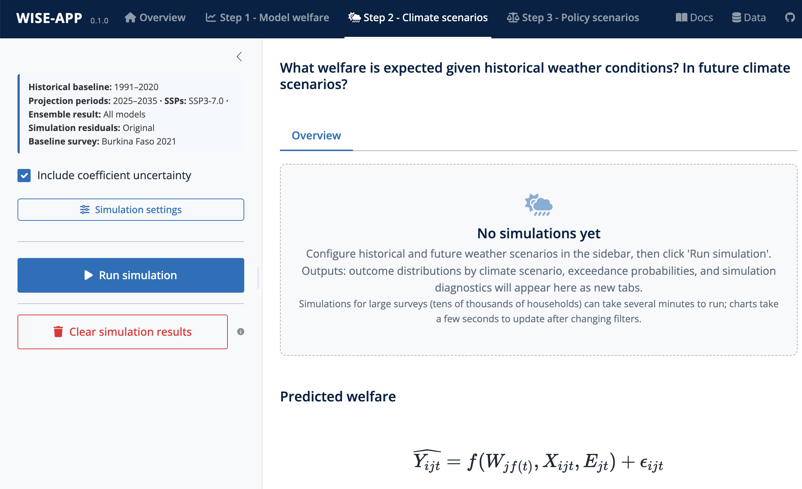

## Overview

Step 2 applies the empirical model fitted in [Step 1 (Model Welfare)](step1.qmd) to simulate how household welfare responds to the range of weather conditions expected in a given climate scenario.

It answers the question: **What welfare outcomes are possible under different climate scenarios?**

By combining historical climate variability with future climate projections, the tool constructs **welfare distributions and exceedance probability curves** that quantify both typical annual fluctuations and the likelihood of severe welfare shocks due to extreme weather events.

The simulation workflow is configured via the Step 2 sidebar:

1. **Baseline Survey Population:** Select one or more survey rounds representing the baseline population (defaults to the latest survey wave in each selected economy).
2. **Historical Weather Window:** Define the baseline climatological reference period (slider 1950–2024; default: 1991–2020, 30 years).
3. **Climate Scenarios & Projection Horizons:** Select one or more Shared Socioeconomic Pathways (SSP 2-4.5, SSP 3-7.0, SSP 5-8.5) and specify up to three future projection windows (default: Period 1, 2025–2035).
4. **Uncertainty & Residual Settings:** Configure simulation residuals and model coefficient uncertainty propagation, then run the simulation.

::: {.callout-warning appearance="simple"}
### Stress-Testing Baseline Economies
Simulations apply future climate perturbations while holding the baseline survey population (assets, demographics, economic structure) constant. Projections do not model future economic growth, structural transformation, migration, or technological adaptation. Results should be interpreted as stress-test vulnerability scenarios rather than forecasts of future poverty.
:::

## Step-by-Step Instructions

### 1. Baseline Survey Population

Select the survey round(s) whose households form the simulated population. The default selects the **latest survey wave in each selected economy** from Step 1. Each household enters the simulation with its observed characteristics, observed baseline welfare, and its own Step 1 regression residual, so the baseline distribution is the survey distribution itself.

Because the population is held fixed, comparisons are meaningful **across climate scenarios and horizons** (e.g., SSP 3-7.0 in 2025–2035 vs. SSP 5-8.5 in 2045–2055), not across years of population change.

### 2. Historical Weather Window

The slider (1950–2024, default: 1991–2020) sets the climatological reference window. This window serves two distinct roles:

- It defines the **inter-annual variability ensemble**: each year in the window is one counterfactual weather draw, producing one simulated welfare distribution per year.
- It is the baseline climatology that the delta method perturbs to construct future weather (see [Methodology](#methodology-detail)).

A 30-year window is recommended to capture representative climate variability, including major drought and heat episodes.

### 3. Climate Scenarios & Projection Horizons

Select one or more SSPs — **SSP 2-4.5**, **SSP 3-7.0** (selected by default), **SSP 5-8.5** — and set up to three projection windows (Period 1 defaults to 2025–2035; Periods 2 and 3 are optional). Every enabled SSP × window combination is simulated independently for each CMIP6 ensemble member with complete projections for the selected weather variables (up to ~30 members). A *Dev mode* checkbox restricts the ensemble to a single model for fast iteration.

::: {.callout-tip appearance="simple"}
### Recommended Simulation Setup
For standard policy assessments, start with **SSP 3-7.0** over the **2025–2035** horizon. In near-term horizons (2025–2035), emissions pathways do not diverge substantially; divergence becomes more pronounced toward mid-century (2050).
:::

### 4. Simulation Settings

Open **Simulation settings** to configure:

- **Simulation residuals** (radio, default `Original`):
  - *Original (recommended default):* each household keeps its own empirical residual from the Step 1 model, preserving individual-level rank heterogeneity across simulation years.
  - *Resample (secondary recommendation):* randomly resamples residuals with replacement from the empirical distribution.
  - Residual settings apply to linear-model simulations; RIF simulations anchor to observed baseline welfare instead (see [Methodology](#methodology-detail)).
- **Include coefficient uncertainty** (default on): propagates Step 1 estimation uncertainty into the aggregates via the analytic delta method. When enabled, *Include uncertainty on all covariates* (default off) widens propagation from weather and interaction coefficients to the full covariance; the toggle has no effect when residuals are not `Original`, because the additive-decomposition argument relies on each household keeping its own residual.
- **Monte Carlo fallback (automatic):** coefficient uncertainty is propagated analytically for all standard aggregates; a Monte Carlo path with a fixed number of draws is used only where the analytic gradient is unavailable or unstable (currently *Average poverty* with few poor households). No user configuration is required.

Click **Run simulation** to execute the pipeline — the historical baseline and all selected SSP × window × ensemble-member combinations. Two tabs appear once complete: **Results** and **Diagnostics**.

#### Interpreting the Results tab

The Results tab opens with top-level analytical controls followed by four panels.

##### Top analysis controls

- **Aggregation Method:** the population aggregate to evaluate:
  - *Mean, Median, Total*
  - *Poverty rate (P0):* share below the poverty line.
  - *Poverty gap (P1):* depth of the poverty shortfall relative to the poverty line.
  - *Poverty severity (P2 / FGT2):* squared poverty gap, emphasizing extreme deprivation.
  - *Gini:* consumption inequality.
  - *Prosperity gap:* average factor by which incomes would need to multiply to reach \$28/day (the World Bank prosperity standard; the threshold is fixed, not the poverty line).
  - *Average poverty (days/\$):* mean number of days of income needed to earn one 2021-PPP dollar — a welfare-based deprivation index (the poverty line does not enter).
  - For other numeric outcomes (e.g., wages), a reduced list is offered: Mean, Median, Total, Outcome headcount ratio, Outcome gap, Outcome severity, and Gini. Binary outcomes support Mean only.
- **Poverty Line:** threshold in 2021 PPP \$/day (default \$3.00, step 0.5) — shown for distribution-sensitive methods only (poverty rate, gap, severity, prosperity gap, average poverty).
- **Deviation from Historical Baseline:** display raw values (`None (raw value)`) or differences relative to the historical baseline mean or median.
- **Coefficient band** and **Inter-model band:** two separate coverage selectors (50%, 60%, 80%, 90%, 95%, 99%, or max/min–max). Defaults: coefficient band **80% (p10–p90)**, inter-model band **full range**. The *Show coefficient uncertainty* / *Show inter-model spread* toggles hide or reveal each layer.
- **Advanced:** headcount smoothing bandwidth (log scale, default 0.05 — the poverty rate uses a kernel-smoothed indicator, so smaller values sharpen the threshold response), group order (Scenario × Year vs. Year × Scenario), and scenario filters.

##### 1. Distribution of outcome across weather conditions, by climate scenario

The main point-range chart shows the central tendency and nested uncertainty layers per scenario (and horizon):

- **Central dot:** the mean of annual aggregates across all simulated (model, year) outcomes.
- **Thick coloured band** (future scenarios only): **inter-model spread** — the quantile range across CMIP6 ensemble members of each member's time-mean aggregate; can be asymmetric when models lean one way.
- **Middle band:** **inter-annual weather variability** — per-model quantile range across simulation years, averaged across models; the natural range of outcomes a single climate trajectory produces.
- **Innermost line:** **analytic coefficient uncertainty** — the per-outcome standard error from the Step 1 regression fit. This is the precision of a point estimate, conceptually distinct from the two spread bands.

The Historical scenario is simulated from observed weather (a single "model"), so it carries no inter-model band.

::: {.callout-tip appearance="simple"}
### Reading Nested Uncertainty Bands
The uncertainty bands answer distinct analytical questions and are not additive. The thick band indicates climate model disagreement, the middle band shows natural annual weather volatility, and the innermost line shows econometric estimation precision. The Diagnostics tab's variance-contribution bar shows how the sources combine.
:::

##### 2. Exceedance probability by climate scenario

Plots the probability that the aggregate exceeds (or falls below) a given threshold in any given year. The **solid central curve** is the empirical exceedance curve of the Historical baseline; for future scenarios no central curve is drawn — the **filled ribbon** shows the inter-model quantile range at each return period, keeping the full model spread visible — and **dashed outlines** (when coefficient uncertainty is enabled) show the analytic SE band around the across-model median, which may fall inside or outside the inter-model ribbon depending on which source dominates. A dotted vertical line marks the historical baseline mean.

- **Logit probability axis toggle** (off by default): expands both tails to display rare events (1-in-10, 1-in-20, 1-in-50 year events).
- **Return-period lines** (on by default): mark standard thresholds — 1-in-5, 1-in-10, 1-in-20, 1-in-50 on the adverse side and their favorable counterparts.
- *Steeper curve:* outcomes tightly clustered; lower sensitivity to annual weather shocks. *Flatter curve:* dispersed outcomes; weather drives large year-to-year swings. *Horizontal shift:* rightward (poverty) or leftward (consumption) movement indicates worse expected outcomes under a scenario relative to the historical baseline.

##### 3. Threshold table

Re-expresses the exceedance curves as an exportable table of exact aggregate values at the median and standard return periods (1-in-5 through 1-in-50, adverse and favorable). For future scenarios it also reports a **pooled standard error** combining coefficient and inter-model uncertainty under an independence assumption ($SE_{\text{pooled}} = \sqrt{\sigma^2_{\text{coef}} + \sigma^2_{\text{across-model}}}$).

#### Interpreting the Diagnostics tab

##### 1. Weather input distributions

Density plots comparing, per weather variable:

1. **Grey fill — full historical:** all years at the survey locations and calendar months.
2. **Black dashed — regression input** (toggle *Include regression output*): the survey-matched weather actually used to fit the Step 1 regression.
3. **Coloured lines — future scenarios:** solid = earliest simulation year, dashed = middle, dotted = latest.

This verifies that scenario perturbations remain plausible and shows directly whether the Step 1 model is being asked to extrapolate beyond the support of its estimation data (see the *Extrapolation Under Climate Change* caveat in [Step 1](step1.qmd)).

##### 2. SD contribution by source of uncertainty

A stacked bar chart attributing the total standard deviation of the aggregate to its sources: **coefficient uncertainty** (SD of the regression-fit per-outcome variance), **inter-annual variability** (within-model year-to-year spread of the aggregate), and **inter-model spread** (across-model disagreement in per-model means; future scenarios only).

::: {.callout-warning appearance="simple"}
### SDs Do Not Add
Variances (not standard deviations) add under independence, so the stacked bar's total length is an upper bound on the true combined SD. Read the bar as a side-by-side decomposition of where uncertainty comes from, not as a literal additive total.
:::

##### 3. Per-model trajectories across simulation years

A spaghetti plot of the year-by-year trajectory of each CMIP6 ensemble member, with a bold across-model median line and a translucent inter-model ribbon at the selected band quantiles. Colour follows the SSP family; linetype distinguishes projection periods.

## Methodology detail

### The Delta Method (Change-Factor Perturbation)

To generate counterfactual future weather, WISE-APP implements the standard **monthly delta method** using climate model projections from the Coupled Model Intercomparison Project Phase 6 (CMIP6) [@auffhammer2013].

Because Global Climate Models (GCMs) have native grid resolutions of 100–250 km and can exhibit local baseline biases, the delta method avoids taking raw GCM absolute values. Instead, it computes the **projected climate change signal** between the GCM historical baseline and the future projection window for each calendar month, and applies that delta to high-resolution (~9 km) observed ERA5-Land historical data.

#### Perturbation mechanics

For each weather variable $v$, each CMIP6 model member $m$, and each location $\ell$ in calendar month $\mu$:

- **Additive perturbation (temperature and dimensionless indices):**
  $$\Delta_{\text{add}}(v, m, \ell, \mu) = \bar{x}_{\text{fut}}(v, m, \ell, \mu) - \bar{x}_{\text{hist}}(v, m, \ell, \mu)$$
  $$x_{\text{fut}}(v, m, \ell, t) = x_{\text{obs}}(v, \ell, t) + \Delta_{\text{add}}(v, m, \ell, \mu(t))$$

- **Multiplicative perturbation (precipitation and day counts; units `mm` or `days`):**
  $$\Delta_{\text{mul}}(v, m, \ell, \mu) = \frac{\bar{x}_{\text{fut}}(v, m, \ell, \mu) + \varepsilon}{\bar{x}_{\text{hist}}(v, m, \ell, \mu) + \varepsilon}$$
  $$x_{\text{fut}}(v, m, \ell, t) = x_{\text{obs}}(v, \ell, t) \times \Delta_{\text{mul}}(v, m, \ell, \mu(t))$$
  where $\varepsilon = 0.001$ protects against division by zero in dry months.

The monthly perturbed values are aggregated to the user's selected temporal window (e.g., 3-month trailing means) to form the counterfactual weather vector $W_{j,t}$. This procedure shifts the long-run monthly mean climatology of each location while preserving the fine-scale spatial variability, inter-annual covariance, and seasonal autocorrelation of the historical observation record.

::: {.callout-note appearance="simple"}
### First-Moment Mean Shifts vs. Variance Scaling
The standard delta method shifts the monthly means of the weather distribution and inherits the historical inter-annual variance. It does not scale future weather variance or alter dry/wet day frequencies. Tail-risk analyses should be interpreted with this structure in mind.
:::

### Simulating Welfare

#### Linear (OLS) model simulation

For linear models, the estimated regression equation is evaluated directly with the counterfactual weather vector $W_{j,t}$:

$$y_{ijt}^* = \hat{\beta} \, W_{j,t} + \hat{\theta} \, M_{ijt} + \hat{\gamma} \, (W_{j,t} \times M_{ijt}) + \hat{\delta} \, X_{ijt} + \hat{\alpha}_j + \hat{\lambda}_t + \hat{\varepsilon}_i$$

$\hat{\varepsilon}_i$ is the household's own residual from the Step 1 training model (under the default residual mode), preserving unobserved idiosyncratic micro-heterogeneity and the empirical dispersion of the welfare distribution. All non-weather terms — covariates, moderators, and the fixed effects $\hat{\alpha}_j$, $\hat{\lambda}_t$ — are evaluated at the baseline survey's observed values, so the simulation captures weather-driven changes only. The residual term is what preserves the population's dispersion: simulating fitted conditional means only would severely compress the simulated distribution and, for log-transformed outcomes, understate the mean ($E[\exp(\varepsilon)] \neq \exp(0)$). Every linear-model simulation therefore adds a residual — either the household's own (`original`) or a resampled draw (`resample`).

#### Unconditional Quantile Regression (RIF) simulation

For RIF models, which estimate quantile-specific coefficients $\hat{\beta}(\tau)$, simulation proceeds in four steps:

1. **Assign baseline quantile position:** $\tau_i = \hat{F}(y_i)$, the empirical CDF of baseline welfare in model scale, clipped to the estimated grid ($\tau \in [0.1, 0.9]$).
2. **Quantile-specific weather deltas:** for each grid point $\tau_k \in \{0.1, 0.2, \dots, 0.9\}$, predict welfare under scenario and baseline weather and take the difference, $\Delta y(\tau_k) = \hat{y}_{\text{scen}}(\tau_k) - \hat{y}_{\text{base}}(\tau_k)$ — equivalent to $\hat{\beta}(\tau_k) \cdot (W_{j,t} - W_{j,\text{base}})$ in the linear model.
3. **Interpolate at the household's rank:** the household-specific impact $\Delta y_i$ is obtained by linearly interpolating between adjacent grid points ($\tau_k \le \tau_i \le \tau_{k+1}$).
4. **Anchor to observed welfare:** $y_i^* = y_i + \Delta y_i$, where $y_i$ is the *observed* baseline welfare. No residual is added: the observed value already embeds the household's idiosyncratic position, which is why the residual-mode setting does not apply to RIF simulations.

::: {.callout-warning appearance="simple"}
### RIF Simulation Assumptions: Distributional Gradients vs. Rank Stability
The RIF simulation applies an estimated distributional gradient across population strata. It relies on a **rank-stability assumption** valid primarily for marginal weather and policy changes (where baseline deciles serve as locally stable reference points). Larger shocks that could induce substantial reranking should be interpreted as scenario extrapolations.
:::

#### Distributional expressiveness: RIF vs. OLS

- **OLS** imposes a homogeneity constraint: a weather shock alters welfare by the same average percentage across the entire distribution, shifting the distribution rigidly.
- **RIF** directly estimates non-uniform shifts that compress or skew the lower tail, capturing inequality in climate vulnerability that OLS assumes away.

### Sources of Uncertainty in Simulations

WISE-APP decomposes and propagates four distinct sources of uncertainty:

1. **Inter-annual weather variability.** Simulating across the 30-year climatological baseline produces **30 distinct counterfactual welfare distributions for the exact same household cross-section**. The spread across simulation years reflects natural inter-annual climate volatility within a fixed climate regime.

2. **Inter-model climate spread (CMIP6 ensemble).** Different climate models project varying degrees of warming and precipitation change under the same greenhouse gas trajectory. Each SSP scenario is simulated independently for every CMIP6 ensemble member with complete projections for the selected variables and windows, capturing structural climate model uncertainty. Following best practice, WISE-APP uses the full ensemble rather than a single or median GCM [@burke2015].

3. **Model coefficient uncertainty.** The coefficients ($\hat{\beta}$) estimated in Step 1 carry statistical sampling error. WISE-APP propagates this parametric uncertainty into aggregate welfare metrics with a closed-form **analytic delta method** based on the coefficient covariance matrix $\Sigma$ — the same location-clustered covariance (`~loc_id_panel`) used for the standard errors reported in Step 1, so displayed confidence intervals and propagated uncertainty share one sampling distribution.

   ::: {.callout-tip appearance="simple"}
   ### Additive-Decomposition Coefficient Uncertainty
   Under the default `original` residual mode, covariates held fixed between baseline and counterfactual scenarios (e.g., household education, demographics) cancel out through the fixed household residual. By default, coefficient uncertainty is therefore restricted to the active coefficients (weather terms and their interactions). The toggle **Include uncertainty on all covariates** propagates the full covariance instead; it has no effect under the `resample` residual mode.
   :::

4. **Simulation residuals.** Model residuals ($\hat{\varepsilon}_i = y_i - x_i'\hat{\beta}$) represent unobserved household-level heterogeneity; the two handling modes are described in [Simulation Settings](#4-simulation-settings). The `original` mode anchors each simulated household to its own residual; `resample` instead redraws residuals from the empirical distribution.

## References {.unnumbered}
