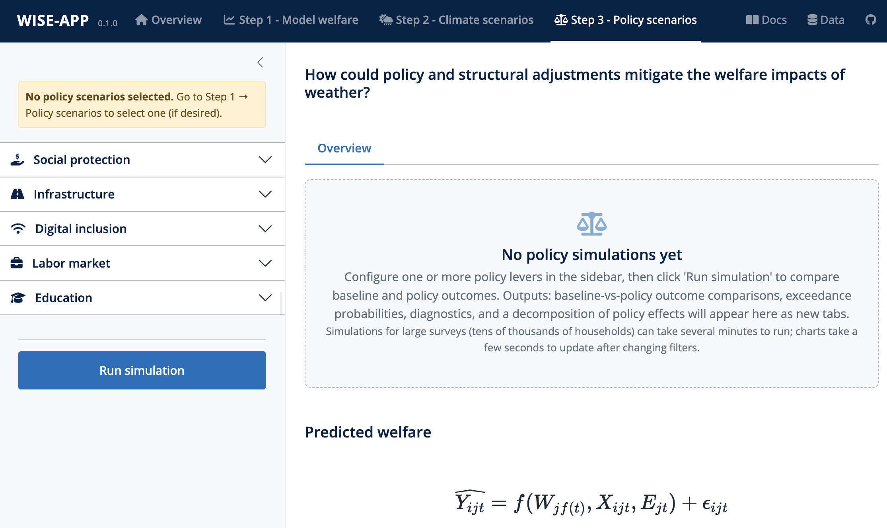

## Overview

Step 3 evaluates how specific adaptation policy scenarios would change the welfare distribution produced in [Step 2 (Climate Scenarios)](step2.qmd). 

It answers the question: **How would welfare outcomes change under counterfactual policy scenarios?**

The levers configured here modify the Step 2 baseline survey, and the policy-adjusted results are derived analytically and presented alongside the Step 2 baseline, using the identical charts and uncertainty decomposition. 

Step 3 then extends the analysis with a **decomposition** that splits the total policy effect into a *main effect* (direct welfare change) and a *resilience effect* (change in weather sensitivity). Because counterfactual welfare is the Step 1 model evaluated at modified household and area characteristics, welfare can change both through levels (households becoming richer with cash assistance or infrastructure access) and through resilience (richer or better-connected households may be less sensitive to weather shocks). This decomposition distinguishes policies that raise welfare levels from policies that reduce vulnerability to weather variability — and from those that do both.

::: {.callout-warning appearance="simple"}
### Policy Variables Must Be in the Step 1 Model
Policy levers act **only through the model specified in Step 1**: a category's controls appear only when its variables were selected in the Step 1 model (as covariates or interaction terms), and the policy simulation mutates only model variables. When a category's variables are absent, the panel shows a placeholder listing the candidate variables to include back in Step 1. The one exception is the social-protection cash transfer, which acts on the welfare outcome itself and therefore requires no Step 1 selection. The recommended way to guarantee a lever is active is to select its policy scenario in Step 1, which locks the corresponding variables into the model as weather interactions (see [Policy Scenarios & Interaction Terms](step1.qmd#policy-scenarios-interaction-terms)).
:::

As in Step 2, **simulations hold the baseline survey population constant** (no economic growth, structural transformation, migration, or technological adaptation) — see the stress-testing caveat on the Step 2 page. The broader economic environment is equally fixed: prices, wages, and labour demand do not respond to the simulated policies (no general-equilibrium feedback), so economy-wide effects of the levers may be under- or overstated.

## Step-by-Step Instructions

### 1. Policy Levers

The current release enables policies across five categories: **Social Protection**, **Infrastructure**, **Digital Inclusion**, **Labour Market**, and **Education**. How a lever adjusts the survey depends on the variable type:

- **Binary access variables** (e.g., electricity access, internet access, educational attainment): a slider changes access by **−20% to +100%**, plus a **Universal** checkbox that sets every household to covered. Positive percentages flip that share of the *currently uncovered* households to covered; negative percentages flip that share of the *currently covered* households back to uncovered. Households are selected at random within each group.
- **Numeric variables** (health-facility travel time): either reduce travel time by up to **−100%** (increase by up to +20%), or set a **maximum travel time** (15–240 minutes) that replaces every household's value exceeding the threshold.
- **Labour-market aggregates**: percentage-point changes to the employment rate and shifts in sectoral composition, applied across the survey (see below).

::: {.callout-note appearance="simple"}
### Random Assignment
Binary and numeric levers assign counterfactual values by random selection within the affected group. Re-running the same policy therefore produces slightly different household assignments; effects on aggregate outcomes are stable, but household-level detail varies between runs. The baseline arm is never re-drawn, so all run-to-run variation is confined to the policy arm.
:::

### 2. Social Protection (Cash Transfers)

Configure a cash-transfer programme for eligible households.

#### Programme Type

The current release enables a **regular cash transfer** — one that pays out regardless of weather conditions.

::: {.callout-note collapse="true"}
#### Shock-Responsive SP (Future Release)
A *shock-responsive* programme — one that activates only after a set trigger — is a planned extension. Candidate triggers include: return period of the weather event ≥ x years; a specific weather variable exceeding a numeric threshold; modelled welfare loss ≥ \$x; or a modelled increase in the poverty gap ≥ \$x.
:::

#### Budget and Transfer Amount

Two budget modes are available:

- **Transfer-first** (default) — specify the transfer per household per payment (\$); the total programme budget is derived from the number of beneficiaries. The per-payment amount is annualized (amount × payments per year) and converted to a daily welfare-equivalent before being added to predicted welfare.
- **Budget-first** — specify a fixed total budget (\$PPP); the **annual** per-household transfer is derived as budget ÷ eligible beneficiaries (weight-aware, so the realised budget matches the fixed amount when survey weights are present) and converted to a daily equivalent. Payment frequency does not apply in this mode.

In both modes the daily transfer is scaled to the welfare variable's units: for household-level analysis, welfare is measured per capita, so the entered per-household amount is divided by household size before being added.

::: {.callout-note collapse="true"}
#### Budget-First Mode Extensions (Future Release)
Additional budget bases — a share of modelled welfare loss, a proportion of the modelled poverty increase, or a fraction of annual expected loss — and transfer schedules that vary by household characteristic are planned extensions; only the fixed-budget mode is currently active.
:::

#### Targeting

Select which households receive the transfer:

- **Universal** (default) — all households receive the transfer; no inclusion or exclusion error is applied.
- **Ex-ante poor** — households at or below the adjustable "poorest bottom x%" cutoff (5–60% in steps of 5, default 20%) of observed baseline welfare.
- **PMT (proxy means test)** — households flagged by a Step 1 model covariate: pick a numeric covariate and include households with a value at or below a chosen cutoff (slider over the variable's observed range, defaulting to its 20th-percentile value); for binary covariates, target the households where the variable equals 0 or 1 (default 0).

For non-universal targeting, users can specify the simulation's targeting errors to better reflect real-world programme implementation:

- **Inclusion error** (default 10%, range 0–30%) — the share of non-eligible households incorrectly included in the programme.
- **Exclusion error** (default 10%, range 0–30%) — the share of eligible households incorrectly excluded.

#### Frequency and Timing

Specify the number of transfer payments per year (2–24, default 6; transfer-first mode only). The daily welfare-equivalent transfer is the per-payment amount scaled to the payment frequency.

### 3. Infrastructure

The infrastructure category exposes a lever for each access variable included in the Step 1 model:

- **Access to electricity** (`electricity`)
- **Improved water access** (`imp_wat_rec`)
- **Sanitation access** (`imp_san_rec`)
- **Piped water access** (`piped`)
- **Piped water access (on premises)** (`piped_to_prem`)
- **Improved water and sanitation access** (`imp_wat_san_rec`) — a derived indicator, equal to 1 only where both improved water and improved sanitation are present.

Each is a binary lever (−20% to +100% or Universal). In addition:

- **Access to health facility** (`ttime_health`, numeric): reduce travel time by a percentage (−100% to +20%) or set a maximum travel time (15–240 minutes).

### 4. Digital Inclusion

Binary levers for:

- **Internet access** (`internet`)
- **Mobile phone ownership** (`cellphone`)

Each supports universal coverage or a percentage change from baseline (−20% to +100%).

### 5. Labour Market

Labour-market levers apply aggregate shifts to the survey and are gated on the corresponding Step 1 variables:

- **Employment rate change** (−20 to +20 percentage points, default 0) — available when employment variables (`employed`, `selfemployed`, `unemployed`) are in the model. Positive values flip unemployed households into employment (negative values the reverse), preserving the existing employed/self-employed split.
- **Sectoral composition** (% of employment) — available when `agriculture`, `industry`, and `services` are all in the model. Set **Manufacturing** and **Services** shares (0–100%); **Agriculture adjusts automatically** to sum to 100%. Only currently working (employed or self-employed) households are reallocated, moving from sectors above their target share to those below.

### 6. Education

Binary levers for educational attainment:

- **Primary completion** (`educ_com1_hh`)
- **Secondary completion** (`educ_com2_hh`)
- **Post-secondary completion** (`educ_com3_hh`)

Each supports universal coverage or a percentage change from baseline (−20% to +100%).

### 7. Running the Policy Simulation

Once the policy parameters are set, click **Run simulation**. Step 3 inherits the Step 2 configuration — the exact baseline survey frame, historical weather window, climate scenarios, projection horizons, residual mode, and uncertainty settings — so nothing needs to be re-entered. The run mutates a copy of the baseline survey with the levers, computes each household's welfare change under the Step 1 model, and adds those deltas to the Step 2 pipelines (see [Methodology detail](#methodology-detail) for the derivation). Three tabs appear on completion: **Results**, **Diagnostics**, and **Decomposition**.

#### Interpreting the Results tab

The Results tab mirrors Step 2's layout and controls (aggregation methods, poverty line, deviation from historical baseline, coefficient and inter-model band selectors, exceedance curves, return-period table, per-model trajectories). The difference is the scenario series: **Baseline** and **Policy** are drawn side by side for every climate scenario and horizon — grey, white-filled dots and faded curves for the baseline; red dots and fully opaque curves for the policy — with the historical entry shown once under the baseline. When a deviation view is selected, both arms are expressed relative to the **baseline** historical mean or median. Read the charts exactly as described on the Step 2 page; the policy's effect is the gap between each paired series. A policy that flattens the exceedance curves without shifting their level indicates a pure resilience effect — average welfare is unchanged but exposure to weather extremes falls — a distinct and valuable adaptation outcome.

#### Interpreting the Diagnostics tab

The Diagnostics tab validates the policy construction:

- **Total social protection transfer amount** — the programme's population-level annual cost (weight-aware) and the weighted mean annual transfer per eligible unit (household or individual, per the Step 1 analysis unit).
- **Summary of manipulated variables** — for each lever-modified variable, the mean and standard deviation before and after the policy, with the change in mean.
- **Before/after distributions** — per-variable charts of the baseline (grey) vs. policy-adjusted (red) survey: grouped bars of the covered share for binary levers, ridge densities otherwise. The welfare panel includes the cash transfer, so it shows the full post-policy distribution.

::: {.callout-warning appearance="simple"}
### Extrapolation from the Training Data
The policy simulation applies Step 1 coefficients to a modified survey. If the policy moves households to covariate values rarely or never observed in the training data — for example, near-universal electrification in a survey with low baseline access — the coefficients estimated from observed variation may not represent welfare outcomes in that counterfactual regime. This is the covariate-level counterpart of the *Extrapolation Under Climate Change* caveat on the Step 1 and Step 2 pages; the before/after distributions above show how far the levers push the sample.
:::

#### Interpreting the Decomposition tab

The Decomposition tab splits the total policy effect into its channels (formal definitions in [Methodology detail](#methodology-detail)):

- **Main effect** — direct welfare change, decomposed into the cash-transfer effect (social protection) and the covariate-shift effect (infrastructure, digital, labour market, education).
- **Resilience effect** — change in weather sensitivity, decomposed into the interaction channel (both engines) and the repositioning channel (RIF engine only).
- **Total effect** — the sum of both.

Panels:

- **Policy effect decomposition by welfare decile** — stacked bars of the average effect per channel by baseline welfare decile (decile 1 = poorest), in percentage change of welfare, evaluated at the historical-mean weather hazard. RIF models show three channels; linear models two.
- **Decomposition summary** — the population-weighted mean effect per channel in log points and per cent (mean ± SE, median). SEs are propagated from the Step 1 coefficient covariance via the delta method; the total's SE preserves cross-channel covariance and is therefore not the sum of the channel SEs. A warning banner appears when the model contains no weather × policy interaction terms (the interaction channel is zero).
- **Weather β curve** (RIF only) — the weather sensitivity $\hat\beta_W(\tau)$ across the welfare distribution, one panel per weather variable. The repositioning channel arises from households moving along this curve.
- **Policy effect decomposition across climate scenarios** — the same channels per SSP × projection period, with boxplots showing within-period year-to-year variation for the weather-sensitive channels (repositioning, interaction, total); the main effect is constant across years and drawn as points. The dashed line at zero is the historical baseline mean.

Channel totals reconcile exactly with the baseline-vs-policy gap in the Results tab — the policy series is constructed from these deltas.

::: {.callout-tip appearance="simple"}
### Reading the Channels
- Compare the resilience effects of policy types: infrastructure and digital policies reduce weather sensitivity when their variables appear in interaction terms in Step 1; labour-market policies shift sectoral composition and can change exposure differently.
- Run multiple policies individually before combining them, so each combined effect can be attributed to its components.
:::

::: {.callout-note appearance="simple"}
### How the Regression Engine Affects Policy Results
The choice of regression engine in Step 1 has important consequences for policy analysis:

**Linear regression** can produce a resilience effect only through the interaction channel — the modified covariate must appear in a weather × covariate interaction in the Step 1 specification. Cash transfers that raise income have no resilience effect in a linear model unless a cash × weather interaction is explicitly included (uncommon), so the resilience effects of social-protection programmes tend to be understated.

**Distributional regression (RIF)** captures resilience through both the interaction channel and the repositioning channel: cash transfers automatically build resilience by shifting poor households to less weather-vulnerable parts of the welfare distribution, even without any interaction term. This is the more complete measure of total resilience, particularly for poverty-focused analyses.

When comparing policy effects across engine choices, expect the RIF engine to show larger total resilience effects, especially for cash-transfer and social-protection programmes.
:::

## Methodology detail {#methodology-detail}

### Applying Policies to the Survey

Policy levers mutate a copy of the baseline survey before it re-enters the Step 1 model (`apply_policy_to_svy`). Binary levers flip randomly selected households within the affected group; the health-travel-time lever scales or caps values; labour-market levers shift employment status and sector shares. Only variables present in the Step 1 model are mutated, so the Results, Diagnostics, and Decomposition tabs can never surface changes the model ignores. The social-protection transfer is the exception: it is added **after prediction, on the level scale** (`log(exp(ŷ) + transfer)` for log-transformed outcomes), because the transfer acts on welfare itself rather than on a modelled covariate. When the analysis unit is households, the entered per-household transfer is divided by household size so that it matches the per-capita welfare scale.

### Deriving the Policy Arm

The policy results are not obtained by re-simulating every CMIP6 ensemble member. Instead, the run (a) passes the Step 2 baseline pipelines through untouched, and (b) adds each household's closed-form welfare delta $\Delta y_i$ — the same quantity the decomposition below reports — to every pipeline row, matched household-for-household via the survey row index. The policy series therefore shares the baseline's residual draws, weather realizations, and coefficient draws exactly, which makes the baseline/policy comparison internally consistent (a no-op policy yields an identical series) and keeps the policy run fast.

::: {.callout-note appearance="simple"}
### Approximations in the Policy Series
- **SE bands use baseline covariates.** Coefficient-uncertainty bands on the policy series reuse the baseline's factor loadings rather than re-deriving them from the policy-modified design matrix. Central values are exact; bands are a close approximation except for large covariate shifts.
- **Period-mean hazards.** The delta added to the Results-tab series is evaluated at each pipeline's period-mean weather, so year-to-year variation of the policy effect *within* a projection period is not shown there. The Decomposition tab's across-scenario panel does decompose year by year.
- **Engine support.** The delta derivation requires the Step 1 engine to be linear (fixest) or RIF. If the decomposition is unavailable, the policy series silently equals the baseline.
:::

### Decomposition of Policy Effects

For household $i$ with baseline (model-scale) welfare $y_i$, baseline quantile position $\tau_i = \hat F(y_i)$ on the training-outcome ECDF, and weather hazard $\bar W_{jt}$ (the per-location mean of the weather panel being evaluated — the historical window for the summary panels, a scenario's projection period in the across-scenario panel), the total simulated policy effect decomposes as:

$$\Delta y_i = \underbrace{\Delta y_i^{\text{cash}} + \Delta y_i^{\text{covariate}}}_{\text{main effect}} + \underbrace{\Delta y_i^{\text{repositioning}} + \Delta y_i^{\text{interaction}}}_{\text{resilience effect}}$$

- **Cash-transfer effect:** $\Delta y_i^{\text{cash}} = \log\big(\exp(y_i) + T_i\big) - y_i$ for log outcomes, where $T_i$ is the household's simulated daily transfer (zero when not eligible); $T_i$ directly for level outcomes.
- **Covariate-shift effect:** $\Delta y_i^{\text{covariate}} = \sum_v \hat\beta_v(\tau_i) \, \Delta x_{v,i}$ — the Step 1 coefficients evaluated at the household's **pre-policy** quantile position, times the lever-induced covariate changes $\Delta x_{v,i}$.
- **Repositioning channel** (RIF only): the main effect moves the household up the training-outcome ECDF to a post-policy position $\tau_i' = \hat F(y_i + \Delta y_i^{\text{main}})$; the weather coefficient moves along the $\beta_\tau$ curve accordingly, $\Delta y_i^{\text{repositioning}} = \big(\hat\beta_W(\tau_i') - \hat\beta_W(\tau_i)\big) \bar W_{jt}$. The channel is identically zero whenever the main effect is zero, and zero for linear models (constant $\hat\beta$).
- **Interaction channel:** the policy changes the moderator in a weather × moderator term, so the effective weather coefficient changes by $\hat\gamma(\tau_i')\, \Delta M_i$; the channel contribution is $\hat\gamma(\tau_i') \, \bar W_{jt} \, \Delta M_i$, evaluated at the post-policy quantile position. Present for both linear and RIF engines.

Per-channel standard errors are propagated alongside the point effects via the delta method, with coefficient standard errors interpolated along the $\beta_\tau$ curve under a diagonal (no cross-covariance) approximation; channel variances add to the total. Because baseline and policy households are paired on the same population, residual and survey-sampling uncertainty cancel — only coefficient uncertainty remains — and all channel SEs are zero when coefficient uncertainty is switched off in Step 2.
